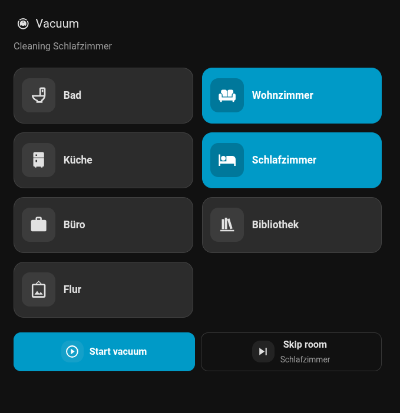

# Vacuum Queue

Maintains one cleaning queue per vacuum. Select Home Assistant areas, map the
values from a current-room tracker, and arm rooms with the generated switches.
Start the queue with the **Start** button or `vacuum_queue.start`; rooms are
cleaned by least-recently-cleaned time, and the **Skip** button moves on to the
next room.

## Setup

1. Add **Vacuum Queue** from Settings → Devices & services.
2. Select a vacuum, its current-room sensor, and the Home Assistant areas to
   clean. If the vacuum has its own segment mapping, room mapping is derived
   automatically; otherwise enter the tracker state values for each room.
3. Turn on the room switches and press **Start**.

## Install with HACS

1. Open HACS → three-dot menu → **Custom repositories**.
2. Enter `https://github.com/poesterlin/ha-vacuum-queue`, select **Integration**,
   and add.
3. Download **Vacuum Queue**, restart Home Assistant, and add it from
   **Settings → Devices & services**.

## Dashboard card

A custom Lovelace card registers itself automatically. Restart Home Assistant
and add one card to the dashboard:



```yaml
type: custom:vacuum-queue-card
show_return_home: false
```

If one Vacuum Queue device exists, the card finds it automatically. With
multiple queues, set `device_id` to the Vacuum Queue device ID.